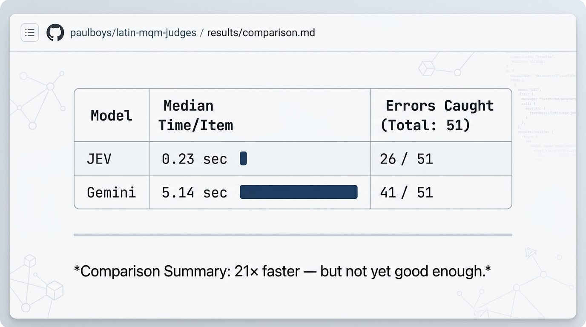

# Results: JEV vs Gemini on the hard set (v3)

**What the figure shows.** On the 107-item hard set (v3: 51 errors, 56 correct renderings), TypeSafe
JEV (`jev-1.13.0`, original 3-question set) returned a judgment about **21× faster** than Gemini 3.1 Pro
used as an MQM judge (median 0.23 s vs 5.14 s per item). It caught **26 of 51** errors, against
Gemini's **41 of 51**.

| v3, run 2 (n = 107) | Median time / item | Errors caught (of 51) | Correct renderings flagged (of 56) | Ranking AUC |
|---|---|---|---|---|
| JEV, original 3 questions | 0.23 s | 26 | 5 | 0.82 |
| JEV, MQM 24 questions (as an issue list) | 0.23 s | 24 | 7 | 0.69 (penalty) |
| Gemini 3.1 Pro (MQM prompt) | 5.14 s | 41 | 6 | 0.90 |

- Gemini caught significantly more errors than either JEV setup (McNemar p < 0.001); the number of
  correct renderings flagged did not differ significantly.
- A first run gave the same picture (JEV 24/51, Gemini 42/51); flag agreement between runs was 94–96 %.
- Tokens per item: JEV 698 (3 questions) or 3,390 (24 questions); Gemini 1,389, of which 420 were
  thinking tokens. Relative cost depends on per-token prices, which are not applied here.

## How to read these numbers

- **Provisional key.** The error labels were written by Claude and have not yet been adjudicated by
  the project's classicist; several are contested. Counts may change once the key is frozen.
- **What "errors caught" means.** JEV counts as flagging an item when its error probability is ≥ 0.5
  or its severity is not "none"; Gemini, when it reports at least one issue. On this set JEV's
  probabilities run low, so a lower cut-off would catch more. 0.5 was fixed in advance.
- **Mix of errors.** The 51 errors are 17 real errors made by MT models and 34 simulated ones. Real
  errors were caught far less often (Gemini 8/17 vs 33/34 simulated), partly because several real
  items are contested renderings.
- **Timing** is wall-clock from one machine, network included.

## Sources

- Judge outputs: `../04_translation_work/ab/antiquitates_ch2/mqm/fluent_v3/runs/` (`*_run2.jsonl`)
- Full analysis: `../04_translation_work/ab/antiquitates_ch2/mqm/fluent_v3/runs/v3_provisional_results.md`
- Raw numbers: `../04_translation_work/ab/antiquitates_ch2/mqm/fluent_v3/runs/v3_run2_efficiency_and_results.txt`
- Reproduce: see the main [README](../README.md#reproduce).
